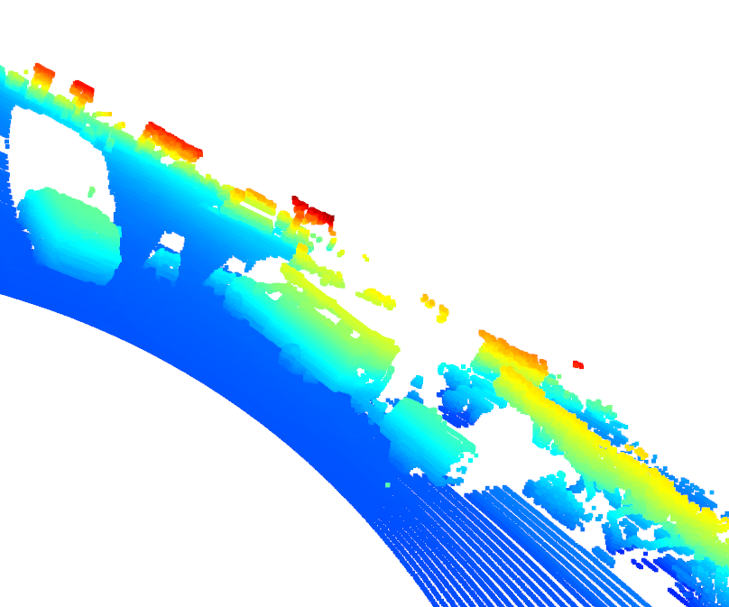

# P2-3d-object-detection 

## How to get things Running:
1) Use `requirements.txt` to install a virtual environment (conda or pip). Make sure to install python version>3.7 and you also might need to install protobuf version>=3.20
2) This code runs in GPU mode by default so make sure to either set the appropiate device or install CUDA
3) This project also utilizes Waymo Open Dataset Reader to access the dataset without explicit download and all the dependencies. Check `tools/waymo_reader/README.md`.
4) This project also requires you to download some files which are mentioned below: 
### Waymo Open Dataset Files
This project makes use of three different sequences to illustrate the concepts of object detection and tracking. These are: 
- Sequence 1 : `training_segment-1005081002024129653_5313_150_5333_150_with_camera_labels.tfrecord`
- Sequence 2 : `training_segment-10072231702153043603_5725_000_5745_000_with_camera_labels.tfrecord`
- Sequence 3 : `training_segment-10963653239323173269_1924_000_1944_000_with_camera_labels.tfrecord`

Once you have done so, please click here to access the Google Cloud Container that holds all the sequences. Once you have been cleared for access by Waymo (which might take up to 48 hours), you can download the individual sequences.

### Pre-Trained Models
The object detection methods used in this project use pre-trained models which have been provided by the original authors. They can be downloaded [here](https://drive.google.com/file/d/1Pqx7sShlqKSGmvshTYbNDcUEYyZwfn3A/view?usp=sharing) (darknet) and [here](https://drive.google.com/file/d/1RcEfUIF1pzDZco8PJkZ10OL-wLL2usEj/view?usp=sharing) (fpn_resnet). Once downloaded, please copy the model files into the paths `/tools/objdet_models/darknet/pretrained` and `/tools/objdet_models/fpn_resnet/pretrained` respectively.

### Using-Precomputed Results
In case you do not include a specific step into the list, pre-computed binary files will be loaded instead. This enables you to run the algorithm and look at the results even without having implemented anything yet. The pre-computed results for the mid-term project need to be loaded using [this](https://drive.google.com/drive/folders/1-s46dKSrtx8rrNwnObGbly2nO3i4D7r7?usp=sharing) link. Please use the folder `darknet` first. Unzip the file within and put its content into the folder `results`.

## External Dependencies
Parts of this project are based on the following repositories: 
- [Simple Waymo Open Dataset Reader](https://github.com/gdlg/simple-waymo-open-dataset-reader)
- [Super Fast and Accurate 3D Object Detection based on 3D LiDAR Point Clouds](https://github.com/maudzung/SFA3D)
- [Complex-YOLO: Real-time 3D Object Detection on Point Clouds](https://github.com/maudzung/Complex-YOLOv4-Pytorch)

# Mid-term Results

* ### Range-Image results [ID_S1_EX1]

* ### LiDAR point clouds [ID_S2_EX2]

1) In the Image (1,1), we can see that the car which is the closes to our vehicle is only partially visible. In the same image we can also see the truck is distinctly visible on the right side of the image.
2) In Image (1,1) and (1,2) we can also spot a big car like SUV which is partially occluded because of another car blocking the LiDAR sensor from picking it up.
3) In Image (4,1) we can see a truck which has a small trailer attached from the rear
4) In Image (3,1) we can also spot a Jeep with its exhaust also picked up by the LiDAR
5) In Image (3,2) we can see the LiDAR detects a big truck on the right side of the car
6) From the LiDAR data we can see that a detected car makes a big shadow behind, which causes the objects behind them un-detectable.

* ### Convert sensor coordinates to BEV-map coordinates (ID_S2_EX1)

* ### Compute intensity layer of the BEV map (ID_S2_EX2)

* ### Compute height layer of the BEV map (ID_S2_EX3)

* ### Section 3 Results

* ### Section 4 Results
1) When `configs_det.use_labels_as_objects = False`: 

1) When `configs_det.use_labels_as_objects = True`: 

# Write-Up

### 1. Write a short recap of the four tracking steps and what you implemented there (filter, track management, association, camera fusion). Which results did you achieve? Which part of the project was most difficult for you to complete, and why?

### 2. Do you see any benefits in camera-lidar fusion compared to lidar-only tracking (in theory and in your concrete results)? 

### 3. Which challenges will a sensor fusion system face in real-life scenarios? Did you see any of these challenges in the project?

### 4. Can you think of ways to improve your tracking results in the future?

## License
[License](LICENSE.md)